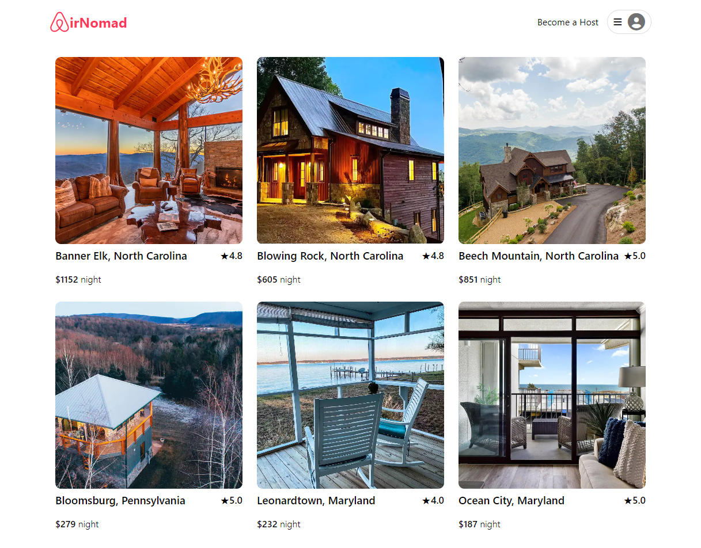
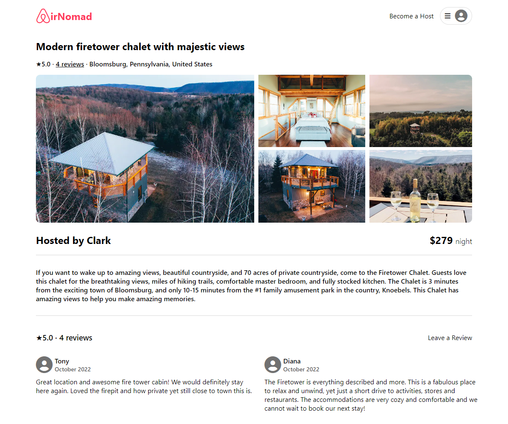

# Welcome to AirNomad!

AirNomad is an Airbnb website clone and the premier destination for booking your next virtual stay! [View the live site here!](https://airbnb-dsiwulec.herokuapp.com/)
_________________________________________________________________________
## Frontend:
* JavaScript
* React
* Redux

## Backend:
* PostgreSQL/Sqlite3
* Sequelize
* Express

## Hosting:
* Heroku
_________________________________________________________________________
## Landing Page
Users can sign up, login, view listings, and, once logged in, become a host! A demo user has been added for convenience and can be found in the dropdown menu in the top right.


## Listing Details
Users can create and delete reviews while the owner of a listing can edit and delete their listing.

_________________________________________________________________________

## Features Roadmap:
* Add booking functionality

* Add the ability to add images to both listings and reviews

* Create dedicated pages for users to view, edit, and delete their reviews and reservations

* Search and filter funcionality for listings and reviews

* Google Maps API integration to enhance booking functionality and listings search
_________________________________________________________________________

## Get started locally:
* Run npm install in both the frontend and backend directories to install all dependencies.

* Run migrations and seeders using ```npx dotenv sequelize db:migrate``` and ```npx dotenv sequelize db:seed:all``` respectively.

* Run npm start in both the frontend and backend directories and then navigate to http://localhost:3000/
